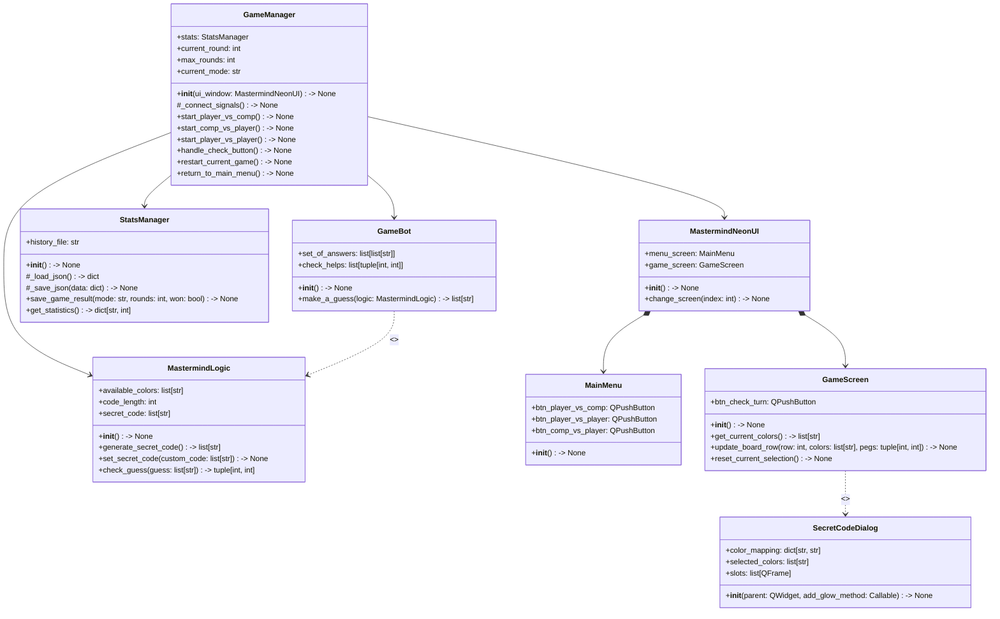

# MASTERMIND
Projekt zespołowy. Gra logiczna Mastermind.

## 1. Środowisko i wymagane biblioteki

* **Interpreter**: Python (wersja >= 3.6)
* **Biblioteki zewnętrzne**: `PySide6`
* **Biblioteki standardowe**: `itertools`, `collections`, `multiprocessing`, `random`, `sys`, `os`
  
### Instalacja zależności:
```bash
pip install PySide6
```
---
## 2. Instrukcja uruchomienia prototypu

### Szybkie uruchomienie automatyczne:
Skrypty automatycznie tworzą środowisko wirtualne `venv`, instalują wymagane biblioteki i włączają grę.

* **System Windows**: Kliknij dwukrotnie plik `start_windows.bat`
* **System Linux / macOS**: Przed pierwszym uruchomieniem nadaj uprawnienia skryptowi, a następnie go odpal:
```bash
chmod +x start_linux.sh
./start_linux.sh
```
### Uruchomienie tradycyjne (Ręczne):
1. Otwórz terminal w głównym katalogu projektu.
2. Wpisz i zatwierdź komendę:

```bash
python app.py
```
---
## 3. Instrukcja użytkowania (Zasady Gry)

* **Cel gry**: Odgadnięcie ukrytego 4-kolorowego kodu w maksymalnie 10 próbach. Kolory w kodzie mogą się powtarzać.
* **Obsługa**: Wybierz kolory z dolnej palety, a następnie zatwierdź pełny wiersz przyciskiem `Check Code`. Użyj przycisku `⌫` (Backspace), aby cofnąć ostatni wybór.

### System podpowiedzi (Informacja zwrotna):
Po każdym ruchu obok wiersza pojawiają się kołki kontrolne:

* **Czarne kropki**: Wskazują prawidłowy kolor na właściwym miejscu.
* **Białe kropki**: Wskazują prawidłowy kolor, ale na błędnym miejscu.

### Dostępne tryby rozgrywki:
1. **Player vs Bot**: Gracz próbuje odgadnąć losowy kod wygenerowany przez komputer.
2. **Player vs Player**: Gracz 1 ustawia kod w ukrytym oknie dialogowym, a Gracz 2 odgaduje go na planszy.
3. **Bot vs Player**: Gracz definiuje kod, a Bot (algorytm Minimax Knutha) automatycznie go odgaduje.
---
## 4. Planowany diagram klas UML gotowej aplikacji


---
## 4. Zaktualizowany plan działania 
W celu dokończenia aplikacji i uruchomienia wszystkich zaplanowanych modułów, w najbliższych tygodniach skupimy się na następujących zadaniach:
* Uruchomienie paneli bocznych interfejsu: Naprawa i aktywacja bocznych sekcji okna gry w PySide6, aby prawidłowo reagowały na działania użytkownika i dynamicznie dopasowywały się do ekranu. 
* Stworzenie modułu statystyk: Napisanie pliku game_stats.py, który będzie odpowiadał za zbieranie danych o o rozgrywkach (np. liczba ruchów, wygrane/przegrane) oraz zapisywanie tych informacji w strukturze pliku game_history.txt..
* Wizualne wdrożenie panelu statystyk: Zaprojektowanie dedykowanego okna lub zakładki w menu graficznym aplikacji, która pobierze dane z pliku tekstowego i wyświetli je użytkownikowi w postaci estetycznej tabeli lub podsumowania.
* Pełna integracja trybów gry: Ostateczne spięcie logiki bota oraz okien dialogowych. 
* Testowanie i optymalizacja: Przeprowadzenie testów całej aplikacji w celu eliminacji błędów, sprawdzenie stabilności działania bota oraz uporządkowanie struktury kodu przed oddaniem projektu. 
---
## 5. Zaktualizowany plan funkcjonalności gotowej aplikacji
Zgodnie z pierwotnymi założeniami projektu, gotowa aplikacja będzie w pełni funkcjonalną grą desktopową Mastermind z interfejsem graficznym PySide6: 
* Trzy niezależne tryby rozgrywki: Pełna obsługa trybów Człowiek vs Komputer, Człowiek vs Człowiek oraz Komputer vs Człowiek (w którym komputer logicznie odgaduje szyfr użytkownika). 
* Menu główne: W pełni responsywne okno startowe pozwalające na wygodny wybór jednego z trzech trybów rozgrywki. 
* Kompletna i dynamiczna plansza gry: Tradycyjna wirtualna plansza z widocznymi rzędami na próby oraz mniejszymi polami na kołki sygnalizacyjne (czarne i białe). 
* Panel statystyk i historii: Działający moduł zapisu wyników, który trwale przechowuje historię rozegranych partii na dysku i wyświetla najlepsze rezultaty bezpośrednio w oknie gry.
